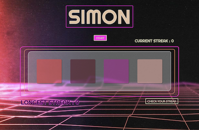
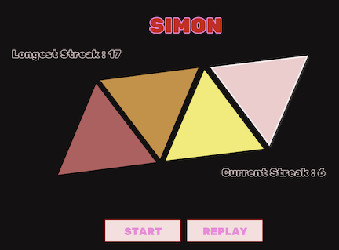

# Simon Game

## Technologies Used
- JavaScript
- HTML
- CSS
## Installation
## Wireframes

## User Stories
## Major Hurdles and Unresolved
- Struggled with overlapping of my buttons which led to functionality issues.
- Was not able to implement a function to check the users' clicks in real time against the computer generated pattern.
- Was not able to have the computer automatically move forward to the next turn after the player has made the correct number of choices.
